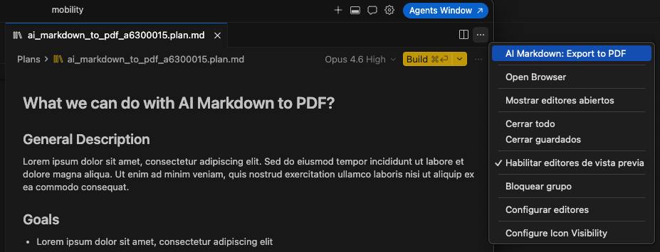
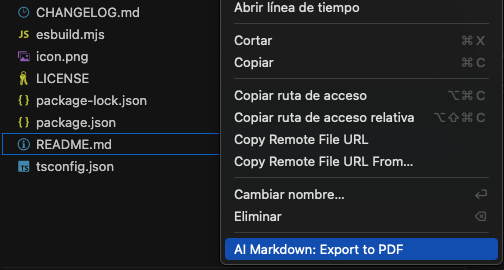
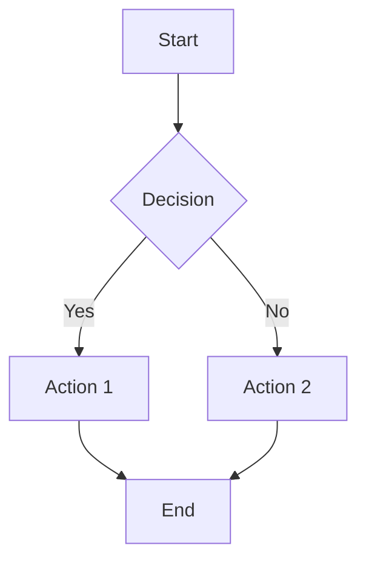

<div align="center">

# AI Markdown to PDF

**Convert AI-generated Markdown files to polished PDFs — with diagrams rendered as real SVG graphics**

[](https://open-vsx.org/extension/jcendal/ai-markdown-to-pdf)
[](https://open-vsx.org/extension/jcendal/ai-markdown-to-pdf)
[](https://open-vsx.org/extension/jcendal/ai-markdown-to-pdf)
[](LICENSE)

[Features](#-features) • [Installation](#-installation) • [Usage](#-usage) •
[Examples](#-examples) • [Settings](#%EF%B8%8F-settings) • [How It Works](#-how-it-works)

[](https://marketplace.visualstudio.com/items?itemName=jcendal.ai-markdown-to-pdf)
&nbsp;&nbsp;
[](https://open-vsx.org/extension/jcendal/ai-markdown-to-pdf)

---

</div>

## 📖 About

AI assistants like **Cursor**, **GitHub Copilot**, and **ChatGPT** generate beautiful
Markdown plans, specs, and documentation — often with Mermaid diagrams for architecture,
flows, and sequences. But when you export them to PDF, diagrams appear as **plain text**.

This extension fixes that. It renders every Mermaid diagram as a real vector graphic
before printing, so your AI-generated documents look professional in PDF form.

### 🎯 Key Highlights

- 🤖 **Made for AI workflows** — Perfect for Cursor plans, Copilot specs, ChatGPT docs
- 📊 **Real SVG rendering** — Mermaid diagrams are actual graphics, not text
- 🎨 **GitHub-flavored styling** — Tables, code blocks, blockquotes, task lists
- 📄 **Page numbers** — Configurable footer with current / total pages
- ⚙️ **Fully configurable** — Page size, orientation, margins, font size
- 🔒 **Privacy-first** — Everything runs locally, no data leaves your machine
- 🖥️ **No bundled browser** — Uses your installed Chrome/Chromium

---

## ✨ Features

| Feature | Description |
| --- | --- |
| **Mermaid diagrams** | Flowcharts, sequence, class, state, Gantt, ER, pie, mindmaps — all as SVG |
| **GitHub styling** | Tables, fenced code blocks with syntax highlighting, blockquotes, task lists |
| **Page numbers** | Configurable footer with current / total pages |
| **YAML front matter** | Automatically stripped from output |
| **Multiple page sizes** | A4, Letter, Legal, A3, A5, Tabloid |
| **Auto-detect browser** | Chrome, Edge, Brave, Chromium — macOS, Linux, Windows |
| **Context menus** | Right-click in editor, explorer, or use Command Palette |

---

## 📦 Installation

Open VS Code / Cursor, launch Quick Open (`Ctrl+P` / `Cmd+P`), and run:

```
ext install jcendal.ai-markdown-to-pdf
```

Or search for **AI Markdown to PDF** in the Extensions sidebar.

---

## 🚀 Usage

Export any Markdown content to PDF in one click. The command **AI Markdown: Export to PDF** is accessible from two locations depending on the type of document you are working with.

### From a Cursor Plan

When working with a plan generated by Cursor (`.plan.md`), click the **⋯** menu in the top-right corner of the editor and select **AI Markdown: Export to PDF**.

<div align="center">

</div>

### From a Markdown file

For any standard `.md` file, right-click on it in the Explorer sidebar or within the editor to open the context menu, then select **AI Markdown: Export to PDF**.

<div align="center">

</div>

### Other access methods

- **Command Palette** — `Cmd+Shift+P` / `Ctrl+Shift+P` → `AI Markdown: Export to PDF`
- **Editor title bar** — top-right area when a `.md` file is active

The PDF is saved alongside the source file and opens automatically in your default viewer.

---

## 📝 Examples

### Supported Mermaid syntax

Write any Mermaid diagram in your Markdown and it will render as a vector
graphic in the PDF:

~~~markdown

~~~

All [Mermaid diagram types](https://mermaid.js.org/intro/#diagram-types) are
supported: flowcharts, sequence diagrams, class diagrams, state diagrams, ER
diagrams, Gantt charts, pie charts, mindmaps, and more.

### Configuration examples

**Landscape A3 for large diagrams:**

```json
{
  "aiMarkdownToPdf.pageSize": "A3",
  "aiMarkdownToPdf.orientation": "landscape"
}
```

**Extra time for complex diagrams:**

```json
{
  "aiMarkdownToPdf.mermaidWaitMs": 10000
}
```

**Custom margins for binding:**

```json
{
  "aiMarkdownToPdf.margins": {
    "top": "20mm",
    "bottom": "20mm",
    "left": "30mm",
    "right": "15mm"
  }
}
```

**Minimal PDF without page numbers:**

```json
{
  "aiMarkdownToPdf.showPageNumbers": false,
  "aiMarkdownToPdf.openAfterExport": false
}
```

---

## ⚙️ Settings

Configure via `File → Preferences → Settings` and search for
`aiMarkdownToPdf`.

| Setting | Default | Description |
| --- | --- | --- |
| `chromePath` | Auto-detect | Absolute path to Chrome/Chromium executable |
| `pageSize` | `A4` | `A4`, `Letter`, `Legal`, `A3`, `A5`, `Tabloid` |
| `orientation` | `portrait` | `portrait` or `landscape` |
| `margins` | `18mm / 15mm` | Object with `top`, `bottom`, `left`, `right` values |
| `fontSize` | `13` | Base font size in pixels |
| `mermaidWaitMs` | `4000` | Time to wait for Mermaid rendering (1000–30000 ms) |
| `showPageNumbers` | `true` | Show page numbers in PDF footer |
| `openAfterExport` | `true` | Open PDF in default viewer after export |

---

## 🔧 Requirements

A Chromium-based browser must be installed:

| Browser | macOS | Linux | Windows |
| --- | :---: | :---: | :---: |
| Google Chrome | ✅ | ✅ | ✅ |
| Microsoft Edge | ✅ | ✅ | ✅ |
| Brave Browser | ✅ | ✅ | ✅ |
| Chromium | ✅ | ✅ | — |

The browser is **auto-detected**. If detection fails:

```json
{
  "aiMarkdownToPdf.chromePath": "/Applications/Google Chrome.app/Contents/MacOS/Google Chrome"
}
```

---

## 🏗️ How It Works

```
┌─────────────┐     ┌──────────────┐     ┌───────────────────┐     ┌──────────┐
│  .md file   │ ──▶ │  marked.js   │ ──▶ │  Headless Chrome  │ ──▶ │   .pdf   │
│             │     │  (HTML)      │     │  + Mermaid.js     │     │          │
└─────────────┘     └──────────────┘     └───────────────────┘     └──────────┘
```

1. Markdown is parsed to HTML with [marked](https://github.com/markedjs/marked)
2. Fenced ` ```mermaid ` blocks become `<pre class="mermaid">` elements
3. HTML is loaded in headless Chrome via [puppeteer-core](https://github.com/puppeteer/puppeteer)
4. [Mermaid.js v11](https://mermaid.js.org/) is loaded from CDN and renders all diagrams as inline SVG
5. The extension waits for rendering to complete (configurable timeout)
6. Chrome prints the page to PDF with the configured settings
7. Temporary HTML file is cleaned up automatically

---

## 🔒 Privacy

This extension runs **entirely on your local machine**:

- ✅ No telemetry or analytics
- ✅ No data collection or transmission
- ✅ Markdown content never leaves your computer
- ✅ The only network request is loading Mermaid.js from `cdn.jsdelivr.net`

---

## 🐛 Known Issues

| Issue | Workaround |
| --- | --- |
| Complex diagrams render incompletely | Increase `mermaidWaitMs` (e.g. `8000` or `15000`) |
| Chrome not found | Set `chromePath` manually in settings |
| Large bundle size (~2 MB) | Expected — puppeteer-core is bundled |

---

## 🤝 Contributing

Contributions, issues, and feature requests are welcome!

1. Fork the [repository](https://github.com/jcendal/ai-markdown-to-pdf)
2. Create your feature branch (`git checkout -b feature/amazing-feature`)
3. Commit your changes (`git commit -m 'feat: add amazing feature'`)
4. Push to the branch (`git push origin feature/amazing-feature`)
5. Open a Pull Request

---

## 📜 License

[MIT](LICENSE) © Jorge Cendal

---

<div align="center">

**Built with ❤️ for the developer community**

[⬆ Back to Top](#ai-markdown-to-pdf)

</div>
